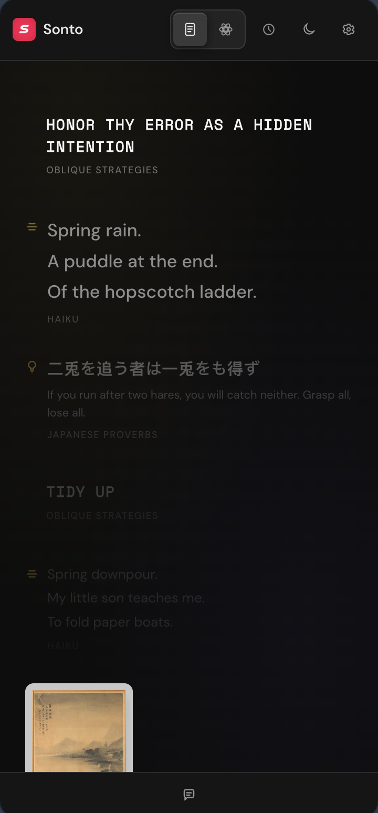

#  SONTO

A calm Chrome sidebar that surfaces a slow drip of art, quotes, science, and news, so you get interesting things to pause on, without social media noise.

[](LICENSE)  

## Screenshots

<table>
  <tr>
    <td></td>
    <td></td>
  </tr>
  <tr>
    <td></td>
    <td></td>
  </tr>
</table>

## Quick start

Clone and build the extension:

```bash
git clone https://github.com/artttj/sonto.git
cd sonto
npm install
npm run build
```

Open `chrome://extensions`, enable **Developer mode**, click **Load unpacked**, then select the `dist/` folder.

The Zen feed works without an API key.
For chat and embeddings, add your key in **Settings > AI**.

| Provider | Get a key |
|---|---|
| OpenAI | https://platform.openai.com/api-keys |
| Gemini | https://aistudio.google.com/app/apikey |

## Features

- **Zen feed**: A slow, thoughtful feed that shows one thing at a time
- **Rich sources**: Museum art, Mars rover photos, Science news, Atlas Obscura stories, quotes, trivia, and more
- **Album of a Day**: A rare daily album card with cover art and titles from a curated 700-album list via MusicBrainz
- **Two modes**: Scrolling feed or Cosmos mode with procedural spirograph animations
- **Themes**: Dark and light themes with WCAG 2.1 AA contrast compliance
- **Save anything**: Highlight text anywhere and press `Alt+Shift+C` or right-click to save
- **Chat with your history**: Ask questions about saved snippets using RAG with OpenAI or Gemini
- **Related pages**: Semantic search surfaces related pages from your browsing history
- **Backup & restore**: Export and import all data as JSON
- **Custom sources**: Add your own RSS feeds or JSON API endpoints
- **Weekly digest**: Optional summary of your saved content
- **BYOK**: Bring your own API key and pay the provider directly

## Zen feed sources

| Source | Content |
|---|---|
| 1000-Word Philosophy | Philosophy essays |
| Atlas Obscura | Curious places and stories |
| Album of a Day | A rare daily pick from 200 Pitchfork and 500 Rolling Stone albums |
| Cleveland Museum of Art | Artworks and facts |
| Getty Museum | Paintings and sculptures |
| Haiku | Japanese haiku poems |
| Hacker News | Top tech stories |
| Japanese Proverbs | With English translation |
| The Met Museum | Public domain paintings |
| Oblique Strategies | Creative prompts |
| Perseverance Rover | Mars surface photos |
| Reddit | Science, history, space, philosophy |
| Rijksmuseum | Dutch Golden Age paintings |
| Smithsonian Smart News | Science and smart news |
| Custom RSS | Your own feeds |
| Custom JSON API | Any endpoint returning items |

Toggle sources in **Settings > Feed > Sources**.

## Languages

- English
- German (Deutsch)

## Privacy

All data stays in your browser.

API calls go directly to OpenAI or Google.
No proxy, no analytics, no tracking.

Feed content comes from public third-party APIs. Sonto does not own or filter it.

- OpenAI Privacy: https://openai.com/policies/privacy-policy/
- Google Gemini Terms: https://ai.google.dev/gemini-api/terms

## Tech

* TypeScript
* Chrome Extension Manifest V3
* Side Panel API
* IndexedDB with cosine similarity search
* esbuild bundling

Zero runtime dependencies.

## License

MIT. See [LICENSE](LICENSE).
