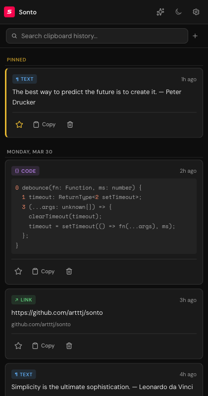
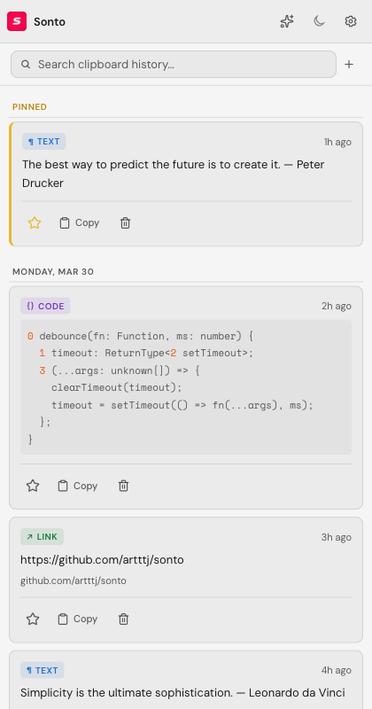

#  SONTO CLIP

**A clipboard manager for Chrome.** Copy anything on any page and browse your history in the sidebar.

[](LICENSE)  

## What it does

Sonto Clip lives in Chrome's side panel. Two things happen there:

**Browse** — Your clipboard history. Everything you copy flows in automatically. Pin what you need, tag it, search it. Related clips surface when you visit a page.

**Prompts** — Saved text snippets with color labels. Organize AI prompts, email templates, code snippets. Quick access from the sidebar.

No accounts. No sync. No tracking. Everything stays on your machine.

## Screenshots

<table>
  <tr>
    <td></td>
    <td></td>
  </tr>
  <tr>
    <td></td>
    <td></td>
  </tr>
</table>

## Install

**Chrome Web Store** — https://chromewebstore.google.com/detail/oddalendfcaonkemohpokibgndnnogag

**Manual install:**

```bash
git clone https://github.com/artttj/sonto.git
cd sonto
npm install
npm run build
```

Open `chrome://extensions`, enable **Developer mode**, click **Load unpacked**, select `dist/`.

## Features

### Clipboard

- Automatic capture of copied text
- Manual capture via right-click or `Alt+Shift+C`
- Pin important items to the top
- Tag and organize clips
- Domain filtering shows related clips for the page you're on
- Search across all items
- Insert snippets directly into form fields

### Prompts

- Save prompts with color labels for quick access
- Organize AI prompts, email templates, code snippets
- One-click copy to clipboard

### Export

- Markdown export for Obsidian with YAML frontmatter
- Full JSON backup of all data

## Keyboard shortcuts

| Shortcut | Action |
|----------|--------|
| `Alt+Shift+S` | Open sidebar |
| `Alt+Shift+C` | Capture selected text |
| `Alt+Shift+F` | Quick search |
| `/` | Focus search (when sidebar open) |

## Privacy

- No accounts, no sign-in
- No analytics, no telemetry
- No cloud sync
- All data in IndexedDB on your machine

## Tech

- TypeScript, Manifest V3, Side Panel API
- IndexedDB for storage
- esbuild for bundling
- Zero runtime dependencies

## Development

```bash
npm install          # Install dependencies
npm run build        # Build to dist/
npm run typecheck    # Type check
npm test             # Unit tests
npm run test:e2e     # E2E tests (requires Chrome)
```

## Architecture

See [ARCHITECTURE.md](ARCHITECTURE.md) for the full technical overview — message passing, IndexedDB schema, build process.

## License

MIT © Artem Iagovdik
