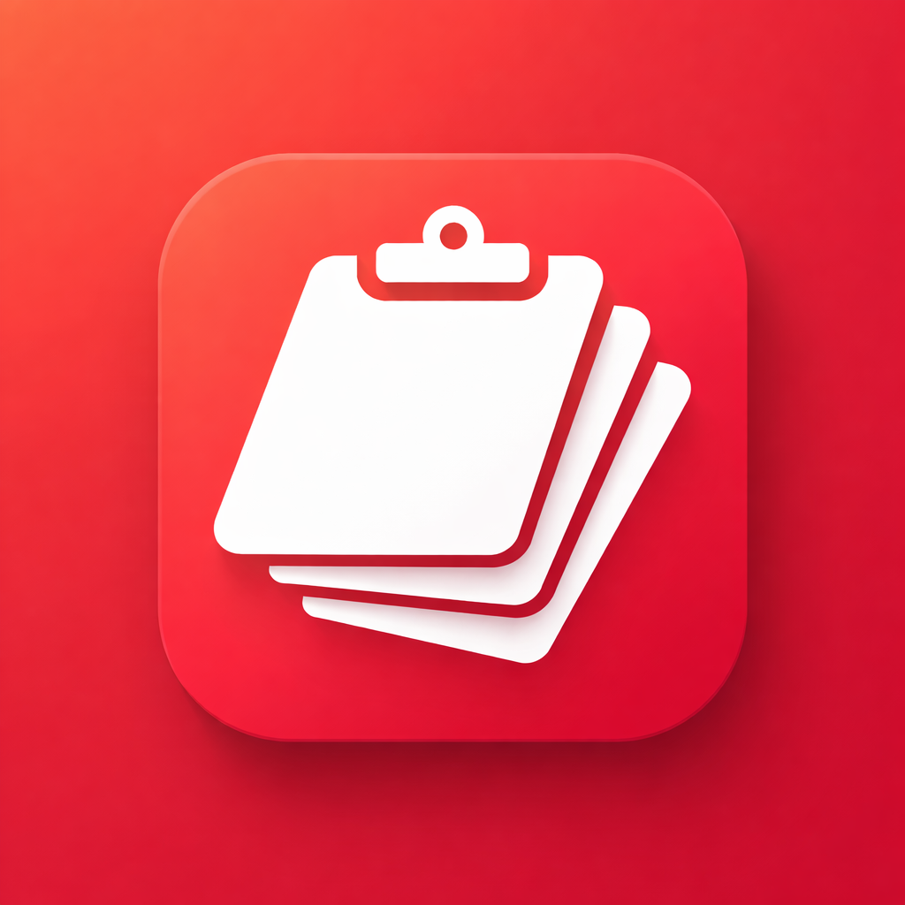
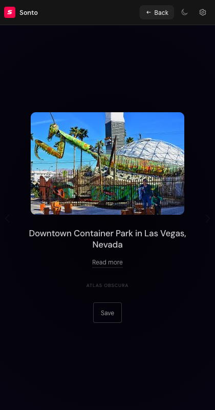
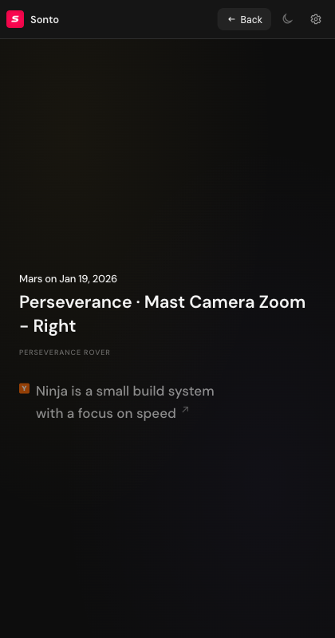
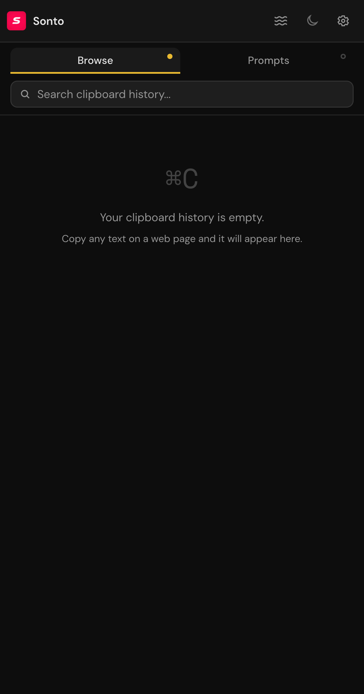
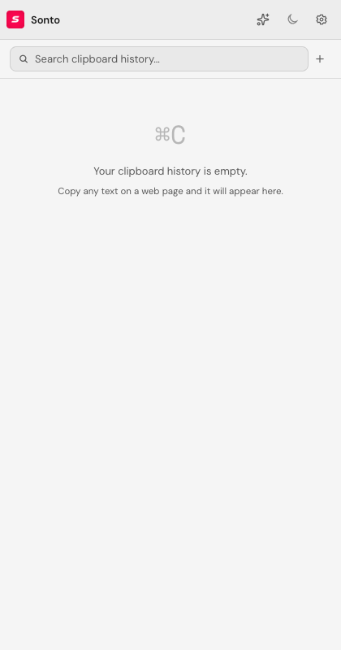
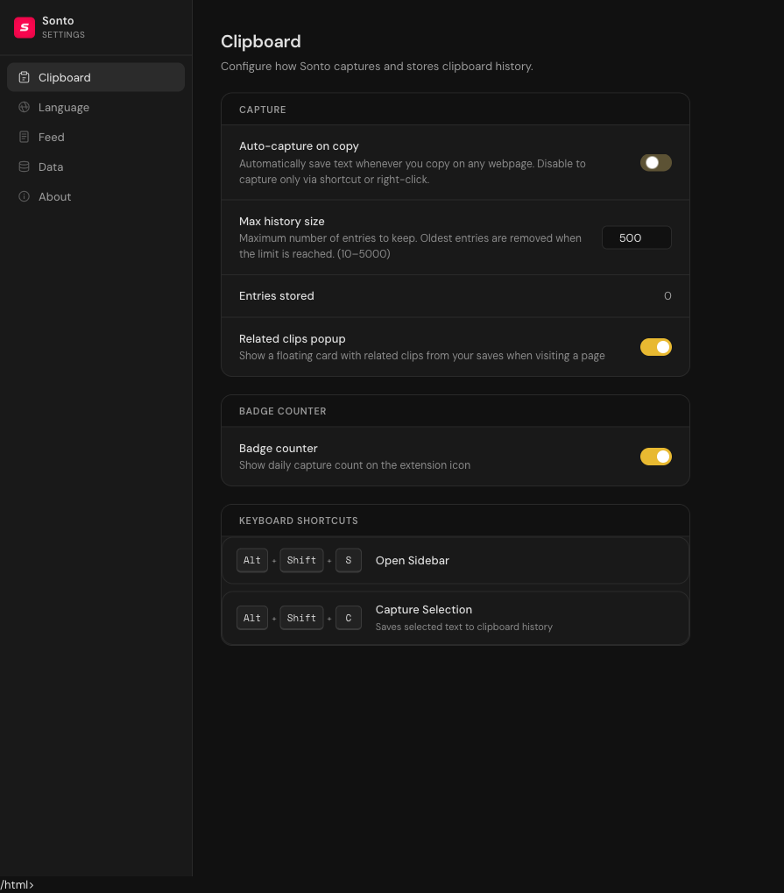
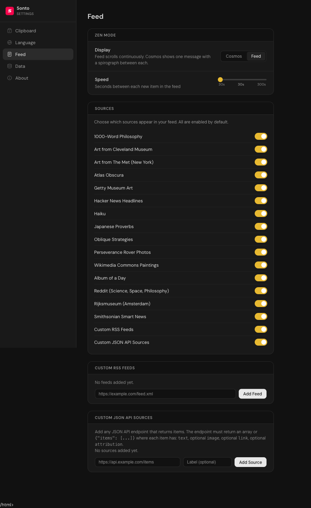

#  SONTO

A calm Chrome sidebar that works as a clipboard manager with an optional zen feed. No API keys needed. Save text snippets, organize prompts, and browse your copy history. Take a break with art, quotes, and interesting content.

[](LICENSE)  

## Screenshots

<table>
  <tr>
    <td></td>
    <td></td>
  </tr>
  <tr>
    <td></td>
    <td></td>
  </tr>
  <tr>
    <td></td>
    <td></td>
  </tr>
</table>

## Quick start

Clone and build the extension:

```bash
git clone https://github.com/artttj/sonto.git
cd sonto
npm install
npm run build
```

Open `chrome://extensions`, enable **Developer mode**, click **Load unpacked**, then select the `dist/` folder.

No API keys needed. The extension works entirely in your browser.

## Features

### Clipboard Manager (Main View)

- **Clipboard history**: Automatically saves copied text. Press Alt+Shift+C or right-click to capture manually
- **Prompt management**: Save and organize your favorite AI prompts with the + button
- **Pin important items**: Keep frequently used snippets at the top
- **Search**: Quickly find items in your history with the search bar
- **Domain filtering**: See related clips when visiting a page

### Zen Feed (Secondary View)

- **Zen mode**: A slow feed with art, quotes, and interesting content when you need a break
- **Two display modes**: Scrolling feed or Cosmos mode with procedural spirograph animations
- **16 content sources**: Museums, philosophy, news, and more
- **Customizable**: Toggle sources in Settings > Feed

### General

- **Themes**: Dark and light themes with WCAG 2.1 AA contrast compliance
- **Languages**: English and German
- **Backup & restore**: Export and import all data as JSON
- **Fully local**: All data stays in your browser. No accounts, no tracking

## Zen feed sources

| Source | Content |
|---|---|
| 1000-Word Philosophy | Philosophy essays |
| Art from Cleveland Museum | Artworks and facts |
| Art from The Met | Public domain paintings |
| Atlas Obscura | Curious places and stories |
| Getty Museum Art | Paintings and sculptures |
| Hacker News Headlines | Top tech stories |
| Haiku | Japanese haiku poems |
| Japanese Proverbs | With English translation |
| Oblique Strategies | Creative prompts |
| Perseverance Rover Photos | Mars surface photos |
| Wikimedia Commons Paintings | Random paintings from curated categories |
| Album of a Day | A rare daily pick from 200 Pitchfork and 500 Rolling Stone albums |
| Reddit | Science, space, philosophy |
| Rijksmuseum | Dutch Golden Age paintings |
| Smithsonian Smart News | Science and smart news |
| Custom RSS Feeds | Your own feeds |
| Custom JSON API Sources | Any endpoint returning items |

Toggle sources in **Settings > Feed > Sources**.

## Keyboard shortcuts

| Shortcut | Action |
|---|---|
| Alt+Shift+S | Open sidebar |
| Alt+Shift+C | Capture selected text |
| Alt+Shift+F | Quick search snippets |
| / (in clipboard view) | Focus search |

## Privacy

All data stays in your browser. No backend. No analytics. No tracking.

Feed content comes from public third-party APIs. Sonto does not own or filter it.

## Tech

* TypeScript
* Chrome Extension Manifest V3
* Side Panel API
* IndexedDB
* esbuild bundling

Zero runtime dependencies.

## Development

```bash
npm install          # Install dependencies
npm run build        # Build extension to dist/
npm run typecheck    # Type check
npm test             # Run unit tests
npm run test:e2e     # Run e2e tests (requires Chrome)
npm run screenshots  # Generate screenshots for docs
```

## License

MIT. See [LICENSE](LICENSE).