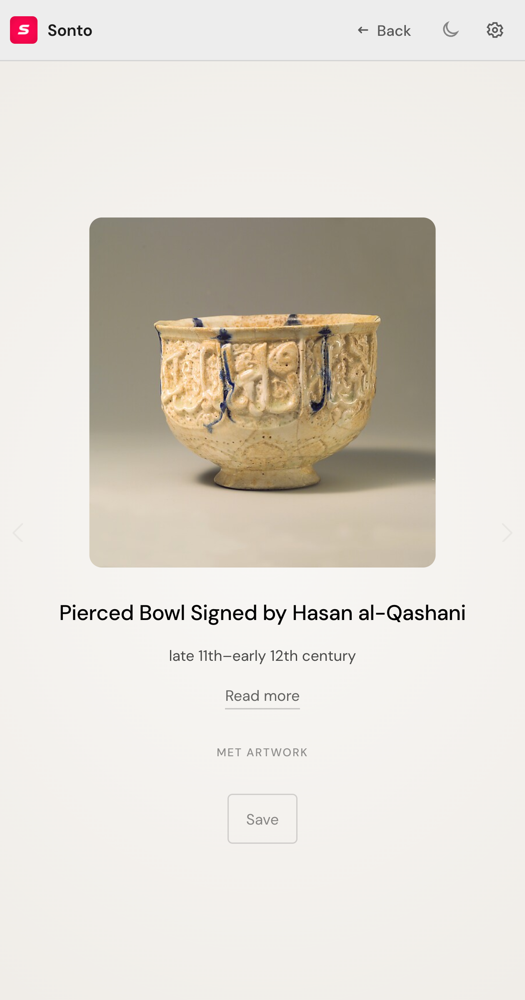

#  SONTO

**A quiet layer for your browser.** Capture what matters. Reuse it later. Take a breath in between.

[](LICENSE)  

## What it does

Sonto lives in Chrome's side panel. Three things happen there:

**Browse** — Your clipboard history. Everything you copy flows in automatically. Pin what you need, tag it, search it. Related clips surface when you visit a page.

**Zen** — A slow feed for when you need a moment. Paintings from museums, philosophy essays, Mars photos, haiku. Content that respects your attention. Time-based: art in the evening, news midday, contemplative pieces at night.

**Reuse** — Saved prompts with color labels. Quick keyboard shortcuts. One-click export to Notion or Obsidian.

No accounts. No sync. No tracking. Everything stays on your machine.

## Screenshots

<table>
  <tr>
    <td></td>
    <td></td>
  </tr>
  <tr>
    <td></td>
    <td></td>
  </tr>
</table>

## Install

**Chrome Web Store** — https://chromewebstore.google.com/detail/oddalendfcaonkemohpokibgndnnogag?utm_source=item-share-cb

**Manual install:**

```bash
git clone https://github.com/artttj/sonto.git
cd sonto
npm install
npm run build
```

Open `chrome://extensions`, enable **Developer mode**, click **Load unpacked**, select `dist/`.

## Features

### Clipboard

- Automatic capture of copied text
- Manual capture via right-click or `Alt+Shift+C`
- Pin important items to the top
- Tag and organize clips
- Domain filtering shows related clips for the page you're on
- Search across all items
- Insert snippets directly into form fields

### Prompts

- Save prompts with color labels for quick access
- Organize AI prompts, email templates, code snippets
- One-click copy to clipboard

### Zen Feed

- 17 built-in content sources
- Time-based content: museums in the evening, news midday, philosophy at night
- Two views: scrolling bubbles or Cosmos (procedural spirograph art)
- Spaced repetition surfaces saved items you haven't seen lately
- Dismiss content to see less of that source

### Export

- One-click export to Notion (opens new page)
- Markdown export for Obsidian with YAML frontmatter
- Full JSON backup of all data

## Content sources

| Source | Type |
|--------|------|
| [The Met](https://metmuseum.org) | Art |
| [Cleveland Museum](https://clevelandart.org) | Art |
| [Getty Museum](https://getty.edu/museum) | Art |
| [Rijksmuseum](https://rijksmuseum.nl) | Art |
| [Wikimedia Commons](https://commons.wikimedia.org) | Art |
| [NASA Perseverance](https://mars.nasa.gov/mars2020) | Photos from Mars |
| Album of a Day | Music |
| [Hacker News](https://news.ycombinator.com) | Tech news |
| [Reddit](https://reddit.com) | Science, space, philosophy |
| [Smithsonian](https://smithsonianmag.com/smart-news) | Science news |
| [The Verge](https://theverge.com) | Tech news |
| [Atlas Obscura](https://atlasobscura.com) | Places and stories |
| [1000-Word Philosophy](https://1000wordphilosophy.com) | Philosophy essays |
| Japanese Proverbs | Kotowaza with translations |
| Haiku | Japanese poems |
| Oblique Strategies | Creative prompts by Brian Eno |
| Custom RSS | Your feeds |
| Custom JSON API | Your endpoints |

Time preferences: Philosophy and proverbs appear more often at night. Art in the evening. News during the day.

## Keyboard shortcuts

| Shortcut | Action |
|----------|--------|
| `Alt+Shift+S` | Open sidebar |
| `Alt+Shift+C` | Capture selected text |
| `Alt+Shift+F` | Quick search |
| `/` | Focus search (when sidebar open) |

## Privacy

- No accounts, no sign-in
- No analytics, no telemetry
- No cloud sync
- All data in IndexedDB on your machine
- Feed content from public APIs — Sonto doesn't own or filter it

## Tech

- TypeScript, Manifest V3, Side Panel API
- IndexedDB for storage
- esbuild for bundling
- Zero runtime dependencies

## Development

```bash
npm install          # Install dependencies
npm run build        # Build to dist/
npm run typecheck    # Type check
npm test             # Unit tests
npm run test:e2e     # E2E tests (requires Chrome)
```

## Architecture

See [ARCHITECTURE.md](ARCHITECTURE.md) for the full technical overview — message passing, IndexedDB schema, zen feed system, build process.

## License

MIT © Artem Iagovdik
